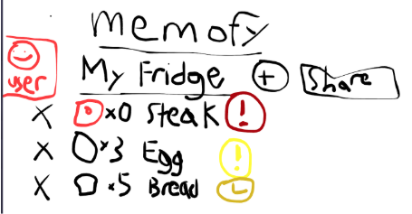
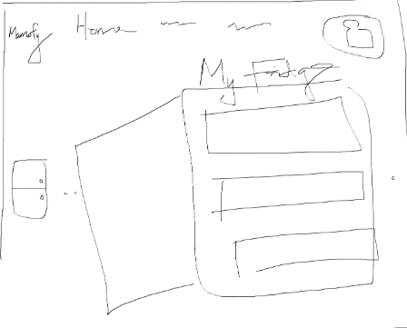
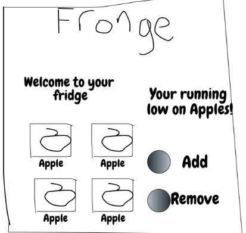
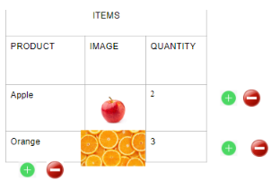

**Group Members:**

| **First Name** | **Last Name** | **Student Number** | **CS-ID** |
| --- | --- | --- | --- |
| Siddhartha | Gupta | 35169151 | w7h0b |
| Kwan | Lam | 42151100 | e6e8 |
| Jaehun | Song | 39131164 | h8u0b |
| Vincent | Chiang | 14316160 | m9y0b |

**Ideas:** Fridge Tracker Application

**Repo:** [**https://github.com/siddhero97/CS436I-Memofy**](https://github.com/siddhero97/CS436I-Memofy)

**Figma Design** https://www.figma.com/file/JsjFPCDJiZp0jOZbW7zU8l/Memofy?node-id=0%3A1

**Project Name: Memofy**

**Project Description:**

Provide an application for grocery shoppers that will help track their kitchen inventory. The app will store the inventory data such as the types of food product, quantity, purchase date, expiration date, costs, and different users. Features include adding and removing items, suggesting recipes and notifications for low inventory

- **Grocery shoppers**
- **Track kitchen inventory**
- **Types of food, quantity, date of purchase, expiry date, cost, users**
- **Keep track of their food**
- **Cool features:**
  - **Recipes**
  - **Delivery from supermarkets**
  - **Notify of sales for commonly purchased food**
  - **Alert for incoming expiry dates**
  - **Subscription service for regularly bought food**
  - **Nutrition**

**Project task requirements:**

- **Minimal requirements**
  - Login page
  - Users can add/remove items
  - Users can see their items
  - User data is saved/stored
  - Responsive UI
  - Users can see their account + settings
- **Standard requirements**
  - Sorting/filter/Search items
  - Feed (for expiry dates/sales?)
  - Email notification (for adding/removing food, etc.)
  - Users can collaborate/share Memofy lists of items with other users
  - Users can set minimum food counts
  - \*Users can add/collaborate recipes
- **Stretch requirements**
  - Mobile app
  - Delivery service
  - Nutrition tracking
  - Subscription service

**Breakdown of 2 minimal requirements:**

- **Users can add/remove items**
  - **Frontend**
    - Buttons on the &quot;display&quot; page to add/remove items
    - A page to add item
  - **Backend**
    - API to POST/DEL user items

- **Users can see their items**
  - **Frontend**
    - A page to display user items
  - **Backend**
    - Create models to support users, items (MongoDB)
    - API to GET user items

**Designs**

